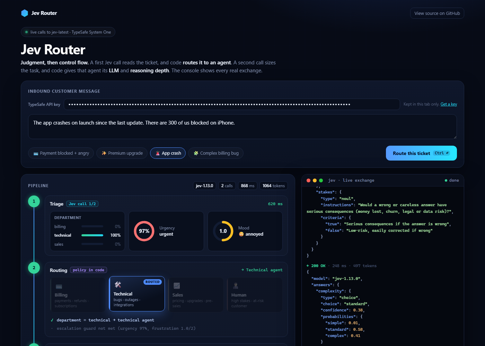

# Jev Router

Typed judgments in, control flow out. A support ticket goes through two [Jev](https://docs.typesafe.ai) calls, and plain code routes it to an agent, then picks that agent's model tier and reasoning depth. A console next to the pipeline shows the raw requests and responses.



**Try it: https://etiennelescot.github.io/jev-router/** (no key needed)

## How it works

1. **Triage**, Jev call 1: department (`choice`), urgency (`noul`), frustration (`score`).
2. **Routing**, in code: department picks the agent. Urgency ≥ 75% and frustration ≥ 1.8 escalate to a human.
3. **Task sizing**, Jev call 2, with the assigned agent in the state: complexity (`choice`), stakes (`noul`).
4. **Agent setup**, in code: complexity sets the model tier and reasoning depth. High stakes add one reasoning level. Human escalation gets the frontier tier to draft the reply.

The model tiers (`fast-8b`, `balanced-70b`, `frontier-1200`) are illustrative labels. The demo does not call them.

## API keys

The Jev API does not accept browser calls from other origins (CORS), so the page posts to a Cloudflare Worker, [`worker/worker.mjs`](worker/worker.mjs), which forwards the call to `api.typesafe.ai`. The Worker code stores and logs nothing.

- **Demo key:** held as a Worker secret, never sent to the browser. It only runs this demo's two question sets ([`questions.js`](questions.js)) on a ticket of up to 1,000 characters, with a per-IP limit of 20 calls a minute.

## Run locally

```bash
cd worker && npx wrangler dev
```

Then, from the repo root, in another terminal:

```bash
python -m http.server 8000
```

Open http://localhost:8000. On localhost the page calls the relay at `http://localhost:8787`. Put `TYPESAFE_API_KEY=...` in `worker/.dev.vars` as the demo key.

## Deploy your own

```bash
cd worker && npx wrangler deploy
npx wrangler secret put TYPESAFE_API_KEY   # optional: demo key for visitors without one
```

Then set `PROXY_URL` in `index.html` to your Worker URL, and `ALLOWED_ORIGIN` in `worker/worker.mjs` to the origin serving the page.

## Test

```bash
node --test "worker/*.test.mjs"
```

## License

MIT
